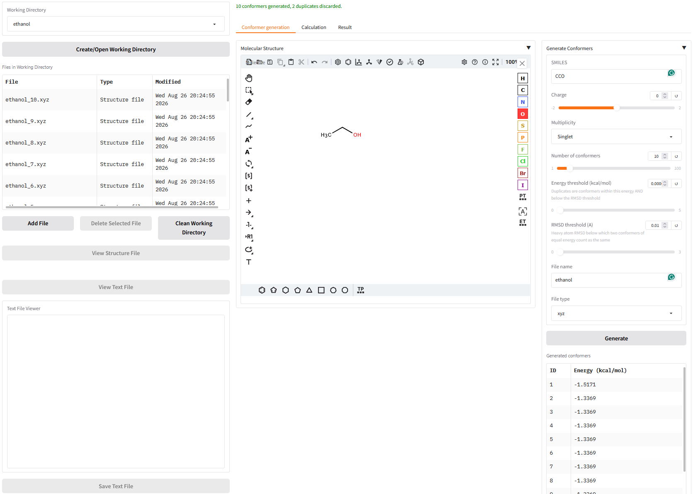
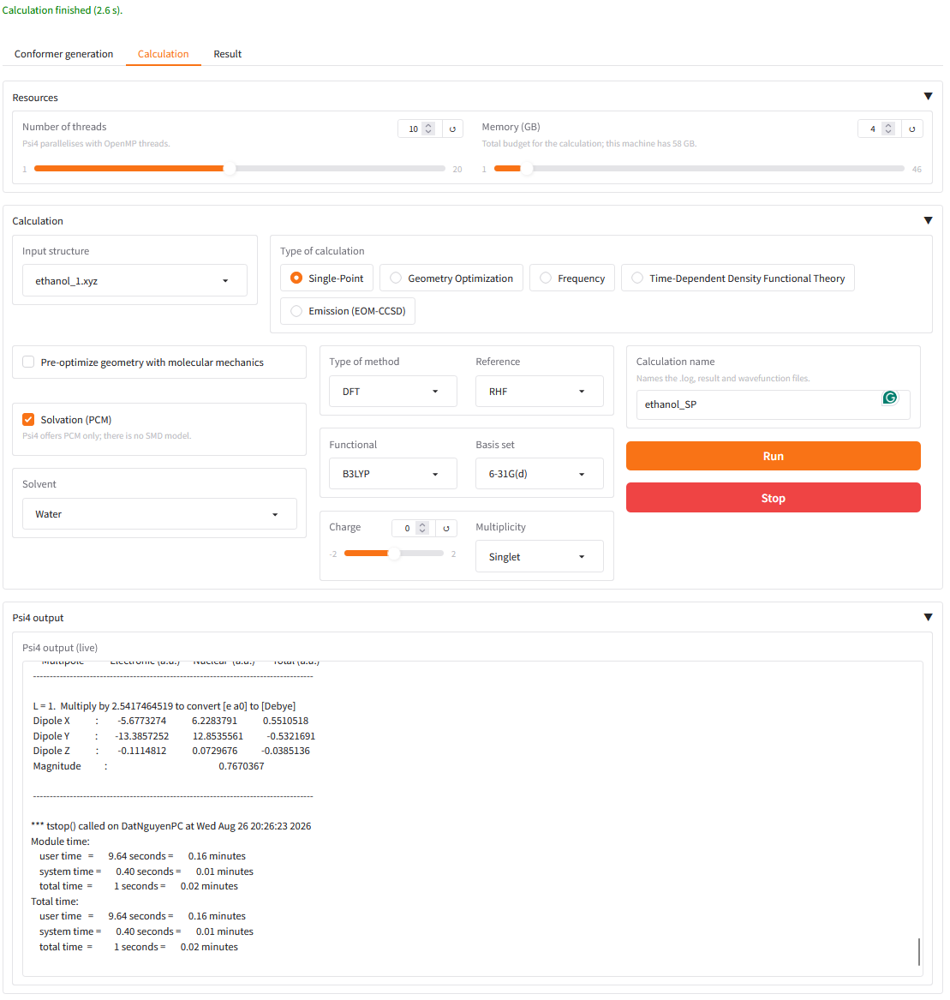
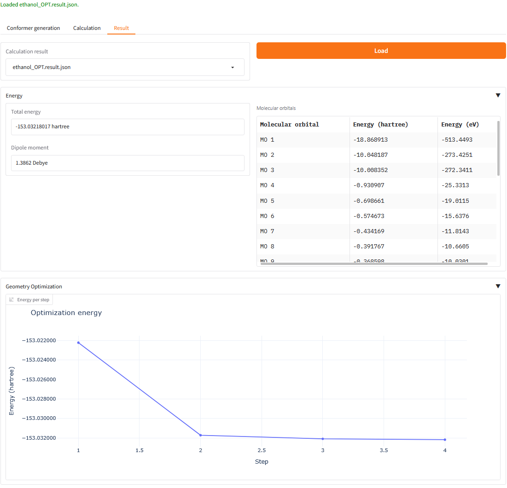
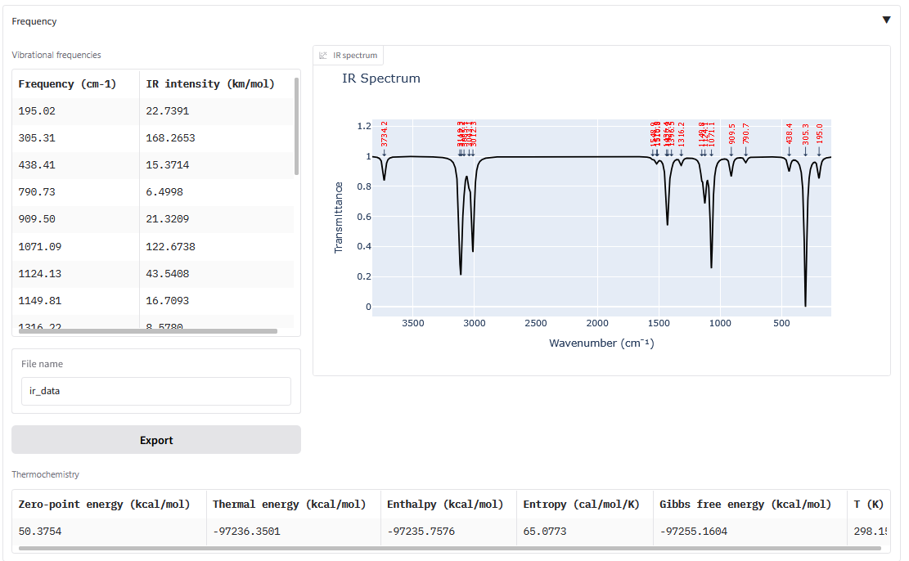
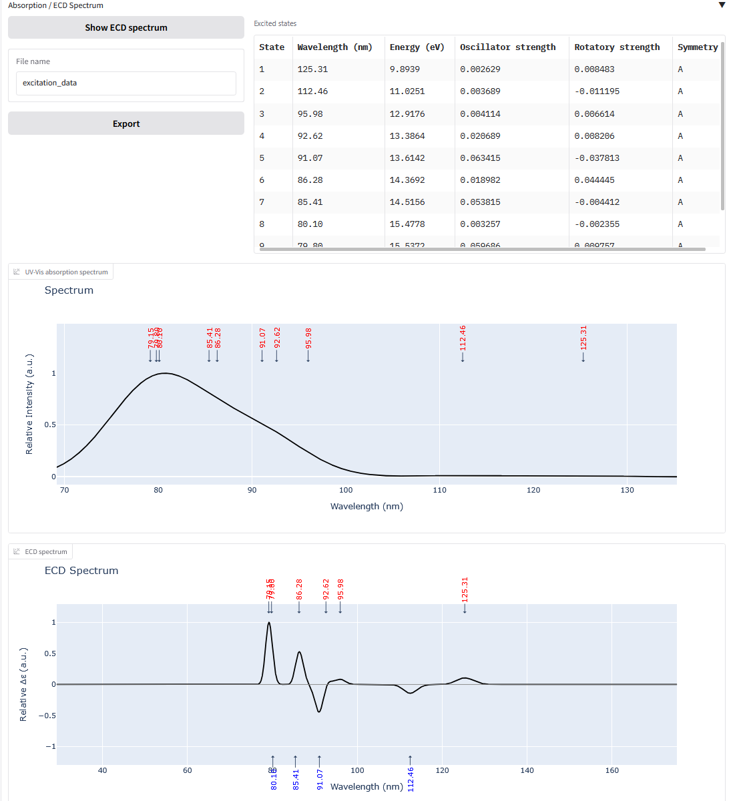

## Introduction

A Gradio web UI for computational chemistry with [Psi4](https://psicode.org/), organised
around a **working directory**: generate conformers, run calculations on them, and
inspect the results — all in one folder you can come back to.







Unlike input-file-driven programs, Psi4 is driven by its Python API, so there is no input
file to write. You pick a structure, choose a method, and press **Run**.

**Features**

- **Working directories** — every structure, log, result and export lives in a named
  folder under `data/`, with a file browser, a 3D structure viewer and an editable text
  viewer.
- **Conformer generation** — draw a molecule or type SMILES, then embed *N* unique
  conformers with RDKit (MMFF94/UFF minimized, deduplicated by both energy and heavy-atom
  RMSD).
- **Calculations** — Single-Point, Geometry Optimization, Frequency (with IR spectrum and
  thermochemistry), TD-DFT (UV-Vis and ECD spectra) and Emission, for HF, DFT, MP2, CCSD
  and CCSD(T), with optional PCM solvation.
- **Emission** — optimizes the excited state and reports the relaxed geometry, the
  emission wavelength and the Stokes-shifted band. Psi4 can only do this with EOM-CCSD, so
  it is expensive: expect it to be practical for small molecules in small basis sets.
- **Live output and a working Stop button** — calculations run in a child process, so the
  Psi4 log streams into the page as it goes and Stop actually stops.
- **Orbitals and densities** — after a calculation, visualize the electron density, the
  electrostatic potential, or any molecular orbital as an isosurface, without re-running
  anything.

## Installation

Psi4 is distributed through conda, so you will need
[Anaconda or Miniconda](https://www.anaconda.com/download).

```bash
git clone https://github.com/phatdatnguyen/psi4-webui
cd psi4-webui

conda create -p ./psi4-env python=3.12
conda activate ./psi4-env

# Psi4 itself (conda-forge only — it is not on PyPI)
conda install psi4 -c conda-forge

# The web UI and its dependencies
pip install -e .

# Optional: the 2D structure editor. It pins gradio<5, which cannot coexist with the
# gradio 5.50 this app targets, so install it without dependencies. Without it the
# conformer tab still works — you type SMILES instead of drawing.
pip install gradio_molecule2d --no-deps
```

## Start the web UI

```bash
psi4-webui
```

or on Windows, `start_webui`. The app serves on the first free port at or after 7860 and
creates `data/` and `static/` in whatever directory you start it from.

## Usage

1. **Working Directory** (left column) — type a name and press *Create/Open*. Everything
   else happens inside it. You can also upload your own `.xyz`/`.pdb`/`.mol`/`.mol2`.
2. **Conformer generation** — draw or type a SMILES, set the charge, multiplicity and how
   many conformers you want, and press *Generate*. Each conformer is written as its own
   structure file. Use one connected molecule; for multiple fragments, upload a prepared
   3D structure with the fragments already positioned.
3. **Calculation** — pick a structure, a calculation type and a method, then press *Run*.
   The Psi4 output streams in below while it works.
4. **Result** — pick the result file and press *Load*. Only the sections the calculation
   actually produced are shown: energy and orbitals always, plus an optimization plot, an
   IR spectrum and thermochemistry, UV-Vis and ECD spectra, or an emission band. Tables
   export to CSV.

## Notes on what Psi4 can and cannot do here

- **No NMR spectra.** Psi4 has no magnetic shielding implementation, so there is no NMR
  tab. SCF properties stop at charges, bond orders, ESP and multipoles.
- **Emission is EOM-CCSD only.** There are no TD-DFT gradients in Psi4, so the excited
  state cannot be relaxed at the DFT level; EOM-CCSD is the only method with an
  excited-state gradient, and it scales as N⁶.
- **The emission band is normalized.** Psi4 does not expose EOM-CCSD transition dipoles,
  so there is no oscillator strength to scale it by. Its position and width are
  meaningful; its height is not. Absorption and ECD spectra do use real intensities.
- **Solvation is PCM only** — Psi4 has no SMD model.

### Files a calculation leaves behind

| File | What it is |
|---|---|
| `<name>.log` | Psi4's own output — the file to read when something looks wrong |
| `<name>.result.json` | Structured results; this is what the Result tab loads |
| `<name>.npy` | Saved wavefunction, used for orbital/density visualization |
| `<name>.job.json` | The job spec handed to the runner (an internal detail) |
| `<name>.runner.log` | Python-level diagnostics, for the rare case Psi4 dies outright |
| `<name>_optimized.xyz` | Optimized geometry — reusable as input for a follow-up run |
| `<name>_trajectory.xyz` | Multi-frame optimization trajectory |

*Clean Working Directory* removes Psi4's scratch files (`timer.dat`, `*.clean`) when you
are done.

## Development

```bash
pip install -e ".[dev]"

pytest                                    # whole suite
pytest -m "not psi4"                      # skip the tests that invoke real Psi4
pytest tests/test_runner_contract.py      # one file

python -m build && python -m twine check dist/*
```

Most of the suite runs without Psi4 installed; the end-to-end tests in
`tests/test_psi4_integration.py` are marked `psi4` and skip themselves when it is missing.
